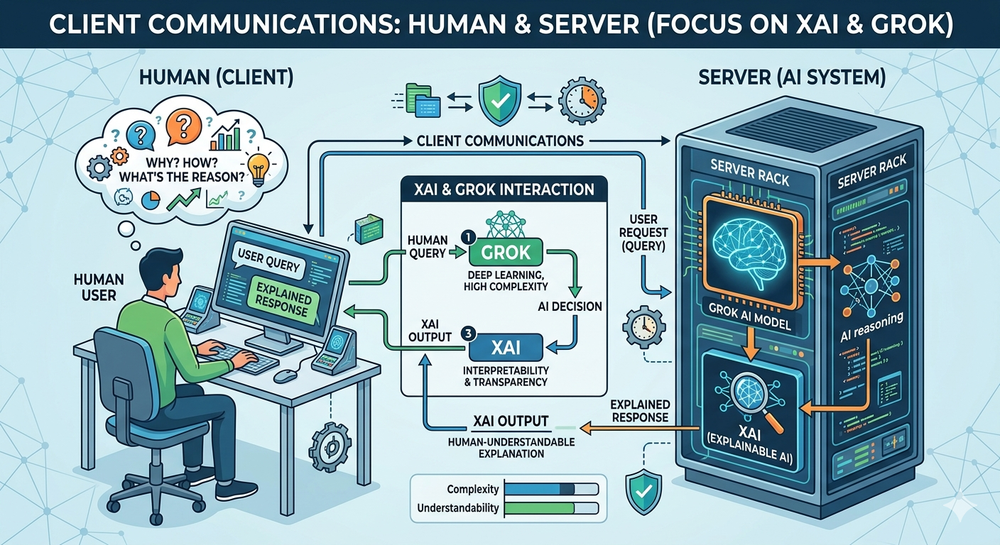

# XAI .NET Client for Grok



The **XAI .NET Client** is a robust, asynchronous library built for developers who need to integrate **xAI's Grok** models into .NET environments. This client is specifically architected to support **Explainable AI (XAI)** principles, providing clear insights into how the AI reaches its conclusions.

## Features

* **Asynchronous Integration:** Built with `Task`-based patterns for high-performance .NET applications.
* **Grok Connectivity:** Native support for the latest Grok API endpoints.
* **Reasoning Transparency:** Direct access to XAI metadata and reasoning logs.
* **Type-Safe Models:** Strongly typed request and response objects for easy development.


## Installation

Install via the .NET CLI:

```bash
dotnet add package OzzieAI.XAI.Client
```

## Getting Started

To begin using the client, initialize the `GrokClient` with your API key and send a prompt:

```csharp
using OzzieAI.XAI;

var client = new GrokClient("YOUR_XAI_API_KEY");

var request = new XaiRequest 
{
    Prompt = "Explain the mechanics of quantum entanglement.",
    IncludeReasoning = true
};

var response = await client.GetExplanationAsync(request);

Console.WriteLine($"Grok Output: {response.Text}");
Console.WriteLine($"XAI Reasoning: {response.ReasoningPath}");
```

or

```
GrokClientConfig GrokClientConfig = GrokClientConfig.EnsureApiKeyConfigured();
GrokClient GrokClient = new GrokClient(GrokClientConfig);

var request = new xAINetClient.ChatRequest
{

    Model = GrokModel.Grok420Reasoning,
    Messages = new List<xAINetClient.ChatMessage>
    {
        new() { Role = "system", Content = systemPrompt },
        new() { Role = "user", Content = userPrompt }
    },
    Temperature = 0.7f
};

var response = await GrokClient.ChatAsync(request);
string? content = response?.Choices?.FirstOrDefault()?.Message?.Content?.ToString().Trim();
```


## Support & Resources

For technical support, documentation updates, or to connect with other XAI developers, please use the following links:

* **Official Website:** [OzzieAI.com](https://www.ozzieai.com)
* **Community Support:** [OzzieAI Forum](https://forum.ozzieai.com)

---
*Maintained by OzzieAI-AU*